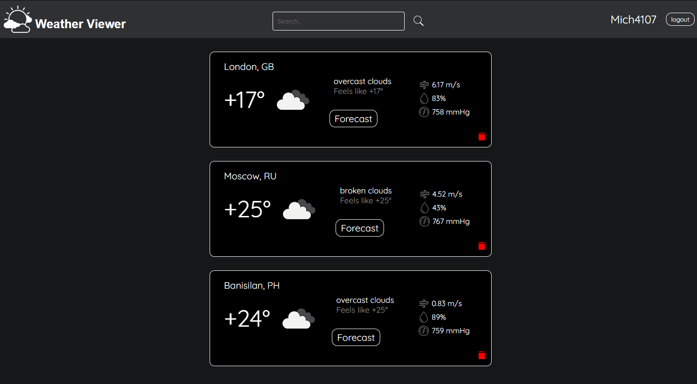
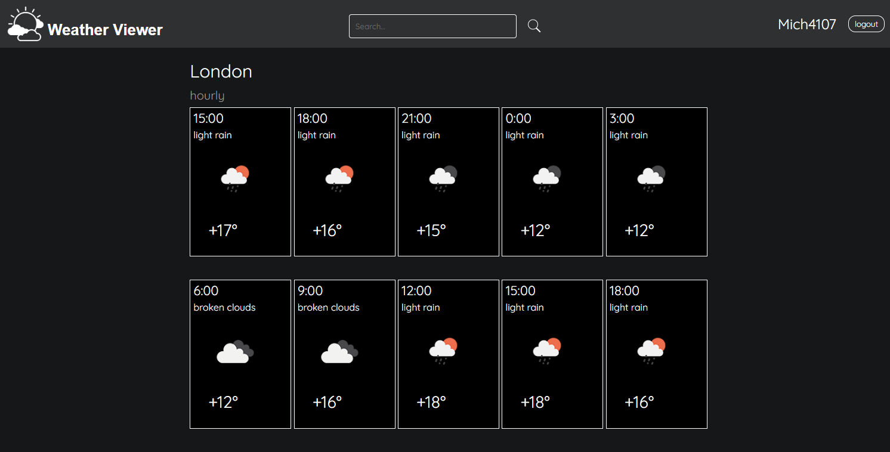

<h1 align="center">Weather viewer</h1>

___

## About project

A web application for viewing the current weather. The user can register and add one or more locations 
(cities, villages, and others) to the list, after which the main page of the application begins 
to display a list of locations with their current weather. User also can see hourly forecast for each location.

## Interface

___

## Functionality

### You can:
1. <h3>User related</h3>

   1.1. `Sign up`

   1.2. `Sign in`

   1.3. `Logout`

2. <h3>Locations related</h3>

   2.1. `search` a location

   2.2. `add` a location in your list

   2.3. `remove` a location from the list

   2.4. `view` a list of locations in your list
  

---

### Design pattern

Application uses [MVC](https://en.wikipedia.org/wiki/Model–view–controller) pattern. 

The `model` here is the **entity** classes that are needed to represent tables from the database. They are using [DAO](https://en.wikipedia.org/wiki/Data_access_object) to communicate with the database.

The `view` layer made by HTML, CSS & Thymeleaf.

The **servlets** act as `controllers`. They handle requests from user and sends HTTP responses.

---

### Sessions & cookies

The application uses cookies and sessions. Cookie is storing in user's browser and session storing in the application database.

Using what was described above, you can identify the user and give him access to the site without signing in again.

However, sessions in the database are deleted if the user has not visited the site for a long time. Cookies are deleted from his browser, and sessions in the database are periodically cleared.

